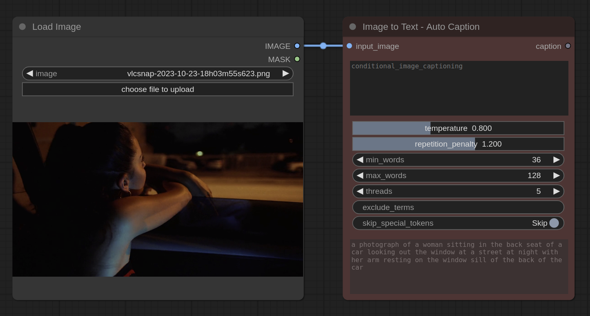

----

*Table of Contents:*

- [Nodes](#nodes)
  - [Image to Text Nodes](#image-to-text-nodes)
    - [*Node* — Image to Text - Auto Caption](#node--image-to-text---auto-caption)
  - [Infinite Parallax Nodes](#infinite-parallax-nodes)
    - [*NODE* — Create Parallax Video](#node--create-parallax-video)
    - [*NODE* — Parallax Config](#node--parallax-config)
    - [*NODE* — Load Parallax Frame](#node--load-parallax-frame)
    - [*NODE* — Save Parallax Object Layers](#node--save-parallax-object-layers)
    - [*NODE* — Layer Shifter for Parallax Outpainting](#node--layer-shifter-for-parallax-outpainting)
    - [*NODE* — Save Parallax Frame](#node--save-parallax-frame)
    - [Video Post-Processing Nodes](#video-post-processing-nodes)
      - [*NODE* — Add Ambiance Sound by Layer Distance](#node--add-ambiance-sound-by-layer-distance)
      - [*NODE* — Add Music from Prompt](#node--add-music-from-prompt)
  - [Compositing Nodes](#compositing-nodes)
    - [*NODE* — Paste Cutout on Base Image](#node--paste-cutout-on-base-image)
    - [*NODE* — Infer Alpha from RGB Image](#node--infer-alpha-from-rgb-image)
  - [Infinite Zoom Nodes](#infinite-zoom-nodes)
    - [*NODE* — Shrink and Pad for Outpainting](#node--shrink-and-pad-for-outpainting)
    - [*NODE* — Load Most Recent Image in Folder](#node--load-most-recent-image-in-folder)
    - [*NODE* — Create Infinite Zoom Video](#node--create-infinite-zoom-video)
  - [Utility Nodes](#utility-nodes)
    - [*NODE* — Size Match Images/Masks](#node--size-match-imagesmasks)
    - [*NODE* — Load Random Img-Pose Pair](#node--load-random-img-pose-pair)
- [To-do](#to-do)

&nbsp;

Custom [ComfyUI](https://github.com/comfyanonymous/ComfyUI) Nodes 🤗. My ***[GUIDE](wiki/creating-custom-comfyui_nodes-guide.md)*** for creating custom nodes, work in progress.

# Nodes

The custom node highlighted is red in the screenshots

## Image to Text Nodes

### *Node* — Image to Text - Auto Caption

Details

- Uses [Salesforce's Blip Image Captioning](https://huggingface.co/Salesforce/blip-image-captioning-large) pretrained on Conceptual Captions dataset
- Returns the caption as a string, and displays it in the node (bottom)
- Fields:
  - input_image (torch.Tensor): [Batch_n, H, W, 3-channel] The input image
  - conditional_image_captioning (str): Conditional captioning phrase
  - temperature (float): 0.1 to 2.0 value to control the randomness of the output
  - repetition_penalty (float): 0.1 to 2.0 value to control the repetition of the output
  - min_words (int): Minimum number of tokens in the output
  - max_words (int): Maximum number of tokens in the output
  - threads (int): The number of beams in the beam search
  - exclude_terms (str): Comma-separated terms to exclude from the output
  - skip_special_tokens (bool): Whether to skip special tokens in the output like [CLS], [SEP], etc.

**Output:** a photograph of a woman sitting in the back seat of a car looking out the window at a street at night with her arm resting on the window sill of the back of the car

## Infinite Parallax Nodes

### *NODE* — Create Parallax Video

Details

- After the set number of iterations is met, the animated parallax video is made
- Each layer has its own panning speed, and the layer videos are stacked on top of each other
- Object layers are recomposited as their own panning videos with associated alpha mask videos

Above is a gif showing the output video on the right

### *NODE* — Parallax Config

- All config options for a parallax video, passes to other parallax nodes as json string

### *NODE* — Load Parallax Frame

Details

- Loads the most recent frame for the parallax video
- If it's the first iteration, it uses the `start_image`
- Allows for automated loopback

### *NODE* — Save Parallax Object Layers

Details

- Only segments and saves object layers if first iteration of project
- Determines lowest layer breakpoint threshold
- Packages all data into config object, which is passed to *Create Parallax Video* node

### *NODE* — Layer Shifter for Parallax Outpainting

Details

- Shifts each layer by its associated velocity
  - The shifting wraps, to enable methods that would use the context of the region when inpainting
- Creates mask for the shifted regions (for inpainting)

### *NODE* — Save Parallax Frame

Details

- Saves the intermediate frame from each iteration step, so the process of saving and organizing each iteration's output frame is all automated

### Video Post-Processing Nodes

#### *NODE* — Add Ambiance Sound by Layer Distance

#### *NODE* — Add Music from Prompt

## Compositing Nodes

### *NODE* — Paste Cutout on Base Image

Details

- Automatically matches size of two images with various size matching methods
- If the cutout doesn't have an alpha channel (not really a cutout), the bg is automatically inferred and made transparent
- Invert option
- Useful for creating logos and when doing things that require object segmentation/removal

**When the cutout doesn't have an alpha channel (BG auto inferred)**

**Alongside auto segmentation**

### *NODE* — Infer Alpha from RGB Image

Details

- Chromakeying, remove white bg, remove black bg, remove neutrals, remove non-neutrals, remove by color
- Invert option
- Leniance/Tolerance/Threshold slider
- When you have an image that clearly has layers or is supposed to be a cutout but doesn't have an alpha channel, or you have lost the alpha channel at some point in your workflow, and auto segmentation is not applicable

## Infinite Zoom Nodes

### *NODE* — Shrink and Pad for Outpainting

Details

- Prioritizes aspect ratio over user specification, when they would conflict

### *NODE* — Load Most Recent Image in Folder

Details

- Allows for iterative workflows where the start image is the end image of the previous iteration, whatever the workflow is
- Can just queue up a ton of iterations at once, and/or observe each output then delete that output from the folder to redo that step, without interrupting the process or having to start over
  - Since it gets the most recent file, you can just delete all files leading up to the point where something went wrong, and start from that leaf
- Optional `start_image` input field for the first iteration, when the folder is empty
  - After the first iteration, and the first new image is generated & saved, the `start_image` is ignored and that new image is used, and so on
- Sorting options: `Most Recent`, `Oldest`

### *NODE* — Create Infinite Zoom Video

- ...

## Utility Nodes

### *NODE* — Size Match Images/Masks

Details

- Automatically matches size of two images with various size matching methods

### *NODE* — Load Random Img-Pose Pair

Details

- Selection methods: random, random no repeat, iterate, iterate backwards, most recent
- Filetype selection
- Keyword selection
- Default dir or custom dir by path
- Double checks if the filenames have indices in them that the pairs have matching indices
- Graceful with file extension selectors and paths

# To-do

- [ ] img2text node
  - [ ] By model
    - [x] BLIP image captioning
    - [ ] vit
    - [ ] CLIP
    - [ ] uform-gen2-dpo
    - [ ] kosmos
    - [ ] llava
    - [ ] blip2-opt
  - [ ] combination
  - [ ] question answering using prompt guide (e.g., subject, medium, artist) to emulate CLIP interrogation but without cyclical training 
- [ ] parallax
  - [ ] iterative object removal -> save -> re-composite with lowest breakpoint layer velocity
    - [ ] idea: "pad region" is a horizontal space between each layer border, such that it overlaps some small number of pixels with both of the connected layers, like a chain link. The chain link moves at the average velocity fo the connecter layers. but instead of iterative inpainting of the shifted region, the entire pad region is re-inpainted after each step. During final video compositing, the different ierations of the pad region are perpetually cross faded. It may also be best to not use any type of velocity at all and keep the pad region static, only having motion as a result of cross-fading
  - [ ] template workflow -> share
    - [ ] iterative auto prompt prepend. maybe. with exclusion list if so
    - [ ] frame interpolation
    - [ ] video post-processing
    - [ ] remove unecessary custom nodes
  - [ ] parallax toolset. add smoke/fog/blur/foreground layer in front, remove background and replace with stuff, create layers or object layers, parallax. another example: https://youtu.be/MvbmVOz08lU?t=1629
  - [ ] use border type of cutout to improve parallax. use a photo like this one in https://www.youtube.com/watch?v=RnEypwmJiaA wherein there are already basically just objects in space to do parallax. create new demo
    - [ ] 2nd type of parallax generator: auto segment -> object layers -> parallax the traditional way like it would be in unity
- [ ] tests
  - [ ] match size node tests