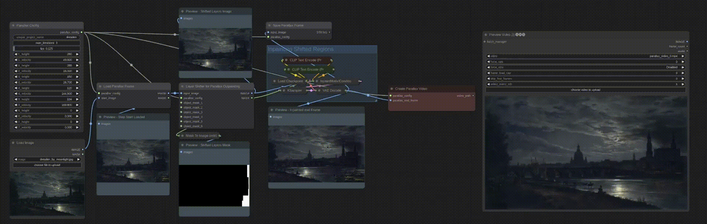

----

*Table of Contents:*

- [Nodes](#nodes)
  - [Compositing Nodes](#compositing-nodes)
    - [*NODE* — Paste Cutout on Base Image](#node--paste-cutout-on-base-image)
    - [*NODE* — Infer Alpha from RGB Image](#node--infer-alpha-from-rgb-image)
  - [Infinite Parallax Nodes](#infinite-parallax-nodes)
    - [*NODE* — Parallax Config](#node--parallax-config)
    - [*NODE* — Load Parallax Frame](#node--load-parallax-frame)
    - [*NODE* — Save Parallax Object Layers](#node--save-parallax-object-layers)
    - [*NODE* — Layer Shifter for Parallax Outpainting](#node--layer-shifter-for-parallax-outpainting)
    - [*NODE* — Save Parallax Frame](#node--save-parallax-frame)
    - [*NODE* — Create Parallax Video](#node--create-parallax-video)
    - [Video Post-Processing Nodes](#video-post-processing-nodes)
    - [*NODE* — Add Ambiance Sound by Layer Distance](#node--add-ambiance-sound-by-layer-distance)
    - [*NODE* — Add Music from Prompt](#node--add-music-from-prompt)
  - [Infinite Zoom Nodes](#infinite-zoom-nodes)
    - [*NODE* — Load Most Recent Image in Folder](#node--load-most-recent-image-in-folder)
    - [*NODE* — Shrink and Pad for Outpainting](#node--shrink-and-pad-for-outpainting)
  - [Utility Nodes](#utility-nodes)
    - [*NODE* — Size Match Images/Masks](#node--size-match-imagesmasks)
- [To-do](#to-do)

&nbsp;

Custom [ComfyUI](https://github.com/comfyanonymous/ComfyUI) Nodes 🤗. I also wrote a ***[GUIDE](wiki/creating-custom-comfyui_nodes-guide.md)*** for creating custom nodes.

# Nodes

The custom node highlighted is red in the screenshots

## Compositing Nodes

### *NODE* — Paste Cutout on Base Image

- Automatically matches size of two images with various size matching methods
- If the cutout doesn't have an alpha channel (not really a cutout), the bg is automatically inferred and made transparent
- Invert option
- Useful for creating logos and when doing things that require object segmentation/removal

**When the cutout doesn't have an alpha channel (BG auto inferred)**

**Alongside auto segmentation**

### *NODE* — Infer Alpha from RGB Image

- Chromakeying, remove white bg, remove black bg, remove neutrals, remove non-neutrals, remove by color
- Invert option
- Leniance/Tolerance/Threshold slider
- When you have an image that clearly has layers or is supposed to be a cutout but doesn't have an alpha channel, or you have lost the alpha channel at some point in your workflow, and auto segmentation is not applicable

## Infinite Parallax Nodes

### *NODE* — Parallax Config

- All config options for a parallax video, passes to other parallax nodes as json string

### *NODE* — Load Parallax Frame

- Loads the most recent frame for the parallax video
- If it's the first iteration, it uses the `start_image`
- Allows for automated loopback

### *NODE* — Save Parallax Object Layers

- Only segments and saves object layers if first iteration of project
- Determines lowest layer breakpoint threshold
- Packages all data into config object, which is passed to *Create Parallax Video* node

### *NODE* — Layer Shifter for Parallax Outpainting

- Shifts each layer by its associated velocity
  - The shifting wraps, to enable methods that would use the context of the region when inpainting
- Creates mask for the shifted regions (for inpainting)

### *NODE* — Save Parallax Frame

- Saves the intermediate frame from each iteration step, so the process of saving and organizing each iteration's output frame is all automated

### *NODE* — Create Parallax Video

- After the set number of iterations is met, the animated parallax video is made
- Each layer has its own panning speed, and the layer videos are stacked on top of each other
- Object layers are recomposited as their own panning videos with associated alpha mask videos

### Video Post-Processing Nodes

### *NODE* — Add Ambiance Sound by Layer Distance

### *NODE* — Add Music from Prompt

## Infinite Zoom Nodes

### *NODE* — Load Most Recent Image in Folder

- Allows for iterative workflows where the start image is the end image of the previous iteration, whatever the workflow is
- Optional `start_image` input field for the first iteration, when the folder is empty
  - After the first iteration, and the first new image is generated & saved, the `start_image` is ignored and that new image is used, and so on
- Sorting options: `Most Recent`, `Oldest`

### *NODE* — Shrink and Pad for Outpainting

- 

## Utility Nodes

### *NODE* — Size Match Images/Masks

- Automatically matches size of two images with various size matching methods

# To-do

- parallax
  - iterative object removal -> save -> re-composite with lowest breakpoint layer velocity
    - idea: "pad region" is a horizontal space between each layer border, such that it overlaps some small number of pixels with both of the connected layers, like a chain link. The chain link moves at the average velocity fo the connecter layers. but instead of iterative inpainting of the shifted region, the entire pad region is re-inpainted after each step. During final video compositing, the different ierations of the pad region are perpetually cross faded. It may also be best to not use any type of velocity at all and keep the pad region static, only having motion as a result of cross-fading
  - template workflow -> share
    - iterative auto prompt prepend. maybe. with exclusion list if so
    - frame interpolation
    - video post-processing
    - remove unecessary custom nodes
- tests
  - match size node tests