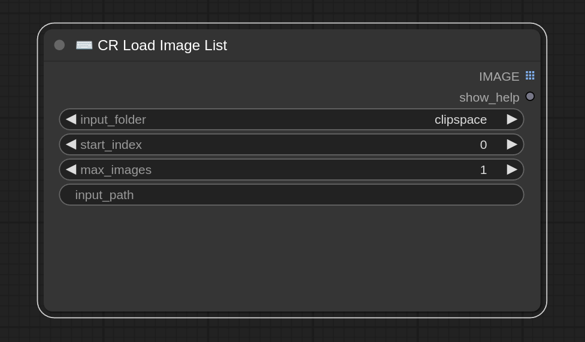

**Creating Custom ComfyUI Nodes - Notes/Guide**

*Table of Contents*

- [Creating a new Node - Basic Setup](#creating-a-new-node---basic-setup)
  - [Step 1 - Directory Structure](#step-1---directory-structure)
  - [Step 2 - Node Class](#step-2---node-class)
  - [Step 3 - Web Directory (Optional)](#step-3---web-directory-optional)
  - [Step 4 - Mappings](#step-4---mappings)
- [Input Field Types](#input-field-types)
  - [Radio Buttons](#radio-buttons)
  - [Sliders](#sliders)
  - [Numbers](#numbers)
    - [Integers](#integers)
    - [Floats](#floats)
  - [Conditioning](#conditioning)
  - [Latent](#latent)
  - [Images](#images)
    - [From a Dropdown Selection of the Images in the Comfy Input Directory](#from-a-dropdown-selection-of-the-images-in-the-comfy-input-directory)
    - [From an Absolute Path](#from-an-absolute-path)
    - [From another Node as a Tensor](#from-another-node-as-a-tensor)
  - [Masks](#masks)
    - [From another Node as a Tensor](#from-another-node-as-a-tensor-1)
- [*Important*: Data Types of Images in Comfy Environment (Tensor Structure)](#important-data-types-of-images-in-comfy-environment-tensor-structure)
- [*Important*: The Batch Dimension](#important-the-batch-dimension)
- [Getting Alpha Channels](#getting-alpha-channels)
- [Debugging](#debugging)
  - [In the Web UI](#in-the-web-ui)
  - [Testing Tools](#testing-tools)
- [Example Nodes](#example-nodes)
  - [Default - Load Image Node](#default---load-image-node)
    - [View](#view)
    - [Code](#code)
  - [Custom - Load Image List Node](#custom---load-image-list-node)
    - [View](#view-1)
    - [Code](#code-1)
- [Resources](#resources)


# Creating a new Node - Basic Setup

## Step 1 - Directory Structure

Create the directory structure for the custom node.

<details>
<summary>Directory Structure Details</summary>

1. Create a project directory for your new node in `ComfyUI/custom_nodes`
2. Create an `__init__.py` file in the project directory
3. Create the python file for your custom node in the project directory
4. Import or copy util functions/files you want from the comfy root directory `ComfyUI/`
    - E.g., if you want to mimic the way `INPUT_TYPES()` is implemented in the [*Load Image*](https://github.com/comfyanonymous/ComfyUI/blob/b3e97fc7141681b1fa6da3ee6701c0f9a31d38f8/nodes.py#L1468) default node in `ComfyUI/nodes.py`, you will want to import and use `ComfyUI/folder_paths.py`
      - So either import [folder_paths.py](https://raw.githubusercontent.com/comfyanonymous/ComfyUI/b3e97fc7141681b1fa6da3ee6701c0f9a31d38f8/folder_paths.py) from the comfy root directory or just copy and paste the file into your custom node dir and import from there

</details>


## Step 2 - Node Class

Create a `class` for your custom node in the python file you created in the project directory.

<details>
<summary>Node Class Details</summary>

From [example_node.py](https://github.com/comfyanonymous/ComfyUI/blob/b3e97fc7141681b1fa6da3ee6701c0f9a31d38f8/custom_nodes/example_node.py.example) in the ComfyUI repo:


```python
class Example:
    """
    A example node

    Class methods
    -------------
    INPUT_TYPES (dict): 
        Tell the main program input parameters of nodes.
    IS_CHANGED:
        optional method to control when the node is re executed.

    Attributes
    ----------
    RETURN_TYPES (`tuple`): 
        The type of each element in the output tulple.
    RETURN_NAMES (`tuple`):
        Optional: The name of each output in the output tulple.
    FUNCTION (`str`):
        The name of the entry-point method. For example, if `FUNCTION = "execute"` then it will run Example().execute()
    OUTPUT_NODE ([`bool`]):
        If this node is an output node that outputs a result/image from the graph. The SaveImage node is an example.
        The backend iterates on these output nodes and tries to execute all their parents if their parent graph is properly connected.
        Assumed to be False if not present.
    CATEGORY (`str`):
        The category the node should appear in the UI.
    execute(s) -> tuple || None:
        The entry point method. The name of this method must be the same as the value of property `FUNCTION`.
        For example, if `FUNCTION = "execute"` then this method's name must be `execute`, if `FUNCTION = "foo"` then it must be `foo`.
    """
    def __init__(self):
        pass
    
    @classmethod
    def INPUT_TYPES(s):
        """
            Return a dictionary which contains config for all input fields.
            Some types (string): "MODEL", "VAE", "CLIP", "CONDITIONING", "LATENT", "IMAGE", "INT", "STRING", "FLOAT".
            Input types "INT", "STRING" or "FLOAT" are special values for fields on the node.
            The type can be a list for selection.

            Returns: `dict`:
                - Key input_fields_group (`string`): Can be either required, hidden or optional. A node class must have property `required`
                - Value input_fields (`dict`): Contains input fields config:
                    * Key field_name (`string`): Name of a entry-point method's argument
                    * Value field_config (`tuple`):
                        + First value is a string indicate the type of field or a list for selection.
                        + Secound value is a config for type "INT", "STRING" or "FLOAT".
        """
        return {
            "required": {
                "image": ("IMAGE",),
                "int_field": ("INT", {
                    "default": 0, 
                    "min": 0, #Minimum value
                    "max": 4096, #Maximum value
                    "step": 64, #Slider's step
                    "display": "number" # Cosmetic only: display as "number" or "slider"
                }),
                "float_field": ("FLOAT", {
                    "default": 1.0,
                    "min": 0.0,
                    "max": 10.0,
                    "step": 0.01,
                    "round": 0.001, #The value represeting the precision to round to, will be set to the step value by default. Can be set to False to disable rounding.
                    "display": "number"}),
                "print_to_screen": (["enable", "disable"],),
                "string_field": ("STRING", {
                    "multiline": False, #True if you want the field to look like the one on the ClipTextEncode node
                    "default": "Hello World!"
                }),
            },
        }

    RETURN_TYPES = ("IMAGE",)
    #RETURN_NAMES = ("image_output_name",)

    FUNCTION = "test"

    #OUTPUT_NODE = False

    CATEGORY = "Example"

    def test(self, image, string_field, int_field, float_field, print_to_screen):
        if print_to_screen == "enable":
            print(f"""Your input contains:
                string_field aka input text: {string_field}
                int_field: {int_field}
                float_field: {float_field}
            """)
        #do some processing on the image, in this example I just invert it
        image = 1.0 - image
        return (image,)

    """
        The node will always be re executed if any of the inputs change but
        this method can be used to force the node to execute again even when the inputs don't change.
        You can make this node return a number or a string. This value will be compared to the one returned the last time the node was
        executed, if it is different the node will be executed again.
        This method is used in the core repo for the LoadImage node where they return the image hash as a string, if the image hash
        changes between executions the LoadImage node is executed again.
    """
    #@classmethod
    #def IS_CHANGED(s, image, string_field, int_field, float_field, print_to_screen):
    #    return ""
```

</details>


## Step 3 - Web Directory (Optional)

Create a web directory for your custom node if you need custom frontend functionality.

<details>
<summary>Web Directory Details</summary>

If you need custom frontend functionality


- [app.js](https://github.com/comfyanonymous/ComfyUI/blob/cb7c3a2921cfc0805be0229b4634e1143d60e6fe/web/scripts/app.js)
- [Example](https://github.com/space-nuko/ComfyUI-OpenPose-Editor/blob/master/js/openpose.js)

For example: [uploadImage.js](https://github.com/comfyanonymous/ComfyUI/blob/cb7c3a2921cfc0805be0229b4634e1143d60e6fe/web/extensions/core/uploadImage.js#L4)

```javascript
import { app } from "../../scripts/app.js";

// Adds an upload button to the nodes

app.registerExtension({
	name: "Comfy.UploadImage",
	async beforeRegisterNodeDef(nodeType, nodeData, app) {
		if (nodeData?.input?.required?.image?.[1]?.image_upload === true) {
			nodeData.input.required.upload = ["IMAGEUPLOAD"];
		}
	},
});
```

Adds Widget [IMAGEUPLOAD](https://github.com/comfyanonymous/ComfyUI/blob/cb7c3a2921cfc0805be0229b4634e1143d60e6fe/web/scripts/widgets.js#L368)

```javascript
IMAGEUPLOAD(node, inputName, inputData, app) {
		const imageWidget = node.widgets.find((w) => w.name === (inputData[1]?.widget ?? "image"));
		let uploadWidget;

		function showImage(name) {
			const img = new Image();
			img.onload = () => {
				node.imgs = [img];
				app.graph.setDirtyCanvas(true);
			};
			let folder_separator = name.lastIndexOf("/");
			let subfolder = "";
			if (folder_separator > -1) {
				subfolder = name.substring(0, folder_separator);
				name = name.substring(folder_separator + 1);
			}
			img.src = api.apiURL(`/view?filename=${encodeURIComponent(name)}&type=input&subfolder=${subfolder}${app.getPreviewFormatParam()}${app.getRandParam()}`);
			node.setSizeForImage?.();
		}

		var default_value = imageWidget.value;
		Object.defineProperty(imageWidget, "value", {
			set : function(value) {
				this._real_value = value;
			},

			get : function() {
				let value = "";
				if (this._real_value) {
					value = this._real_value;
				} else {
					return default_value;
				}

				if (value.filename) {
					let real_value = value;
					value = "";
					if (real_value.subfolder) {
						value = real_value.subfolder + "/";
					}

					value += real_value.filename;

					if(real_value.type && real_value.type !== "input")
						value += ` [${real_value.type}]`;
				}
				return value;
			}
		});

		// Add our own callback to the combo widget to render an image when it changes
		const cb = node.callback;
		imageWidget.callback = function () {
			showImage(imageWidget.value);
			if (cb) {
				return cb.apply(this, arguments);
			}
		};

		// On load if we have a value then render the image
		// The value isnt set immediately so we need to wait a moment
		// No change callbacks seem to be fired on initial setting of the value
		requestAnimationFrame(() => {
			if (imageWidget.value) {
				showImage(imageWidget.value);
			}
		});

		async function uploadFile(file, updateNode, pasted = false) {
			try {
				// Wrap file in formdata so it includes filename
				const body = new FormData();
				body.append("image", file);
				if (pasted) body.append("subfolder", "pasted");
				const resp = await api.fetchApi("/upload/image", {
					method: "POST",
					body,
				});

				if (resp.status === 200) {
					const data = await resp.json();
					// Add the file to the dropdown list and update the widget value
					let path = data.name;
					if (data.subfolder) path = data.subfolder + "/" + path;

					if (!imageWidget.options.values.includes(path)) {
						imageWidget.options.values.push(path);
					}

					if (updateNode) {
						showImage(path);
						imageWidget.value = path;
					}
				} else {
					alert(resp.status + " - " + resp.statusText);
				}
			} catch (error) {
				alert(error);
			}
		}

		const fileInput = document.createElement("input");
		Object.assign(fileInput, {
			type: "file",
			accept: "image/jpeg,image/png,image/webp",
			style: "display: none",
			onchange: async () => {
				if (fileInput.files.length) {
					await uploadFile(fileInput.files[0], true);
				}
			},
		});
		document.body.append(fileInput);

		// Create the button widget for selecting the files
		uploadWidget = node.addWidget("button", inputName, "image", () => {
			fileInput.click();
		});
		uploadWidget.label = "choose file to upload";
		uploadWidget.serialize = false;

		// Add handler to check if an image is being dragged over our node
		node.onDragOver = function (e) {
			if (e.dataTransfer && e.dataTransfer.items) {
				const image = [...e.dataTransfer.items].find((f) => f.kind === "file");
				return !!image;
			}

			return false;
		};

		// On drop upload files
		node.onDragDrop = function (e) {
			console.log("onDragDrop called");
			let handled = false;
			for (const file of e.dataTransfer.files) {
				if (file.type.startsWith("image/")) {
					uploadFile(file, !handled); // Dont await these, any order is fine, only update on first one
					handled = true;
				}
			}

			return handled;
		};

		node.pasteFile = function(file) {
			if (file.type.startsWith("image/")) {
				const is_pasted = (file.name === "image.png") &&
								  (file.lastModified - Date.now() < 2000);
				uploadFile(file, true, is_pasted);
				return true;
			}
			return false;
		}

		return { widget: uploadWidget };
	}
```

</details>

## Step 4 - Mappings

Create mappings indicating the class(es) for your node(s) and their names for the main program to use. Import your custom node class(es) from their file if they are nested in a package.

<details>
<summary>Mappings Details</summary>


Add Mappings to `__init__.py` in the project directory

```python
# /__init__.py

# Import the class(es) for your node(s) from their file
from .path.to.my_custom_node import *

NODE_CLASS_MAPPINGS = {
    'Custom Node Name': MyCustomNodeClass
}

NODE_DISPLAY_NAME_MAPPINGS = {
    'Custom Node Name': 'Custom Node Name Displayed in the Web UI'
}

WEB_DIRECTORY = '../../web
```

- **NODE_CLASS_MAPPINGS**: A dictionary mapping the class(es) for your node(s) to their names. Make the name anything as long as it is unique
- **NODE_DISPLAY_NAME_MAPPINGS**: A dictionary that contains the friendly/humanly readable titles for the nodes
- **WEB_DIRECTORY**: If you want to add a custom frontend extension, you can specify the directory here. See [### Step - Web Directory](#step-3---web-directory)

</details>

# Input Field Types

## Radio Buttons

```python
@classmethod
def INPUT_TYPES(s):
    return {"required":{
                "add_noise": ("BOOLEAN", {"default": True, "label_on": "enable", "label_off": "disable"}),
                "return_with_leftover_noise": ("BOOLEAN", {"default": False, "label_on": "enable", "label_off": "disable"}),
                },
            }
```

*From [ComfyUI-Inspire-Pack](https://github.com/ltdrdata/ComfyUI-Inspire-Pack/blob/main/inspire/sampler_nodes.py)'s `KSamplerAdvanced_progress`*

## Sliders

```python
@classmethod
def INPUT_TYPES(s):
    return {"required":{
                "steps": ("INT", 
                    {
                        "display" : "slider", # Set display to "slider"
                        "step": 1, # Set the increment value for the slider
                        "default": 20, 
                        "min": 1, 
                        "max": 10000, 
                    }
                ), 
            },
        }
```


## Numbers

### Integers

```python
@classmethod
def INPUT_TYPES(s):
    return {"required":{
                "steps": ("INT", {"default": 20, "min": 1, "max": 10000}),
                # Set max to highest possible by using unsigned 64-bit integer
                "noise_seed": ("INT", {"default": 0, "min": 0, "max": 0xffffffffffffffff}),
                "start_at_step": ("INT", {"default": 0, "min": 0, "max": 10000}),
                "end_at_step": ("INT", {"default": 10000, "min": 0, "max": 10000}),
                "interval": ("INT", {"default": 1, "min": 1, "max": 10000}),
                },
            }
```

The `"max"` value for `"noise_seed"` is set to `0xffffffffffffffff`, which is the maximum value representable by an unsigned 64-bit integer. In hexadecimal notation, it represents the value 18446744073709551615. This means that the maximum allowed value for `"noise_seed"` is 18446744073709551615.


*From [ComfyUI-Inspire-Pack](https://github.com/ltdrdata/ComfyUI-Inspire-Pack/blob/main/inspire/sampler_nodes.py)'s `KSamplerAdvanced_progress`*


### Floats

```python
@classmethod
def INPUT_TYPES(s):
    return {"required":{
                "cfg": ("FLOAT", {"default": 8.0, "min": 0.0, "max": 100.0, "step":0.5, "round": 0.01}),
                },
            }
```

`"round"` is the value represeting the precision to round to, will be set to the step value by default. Can be set to `False` to disable rounding.

## Conditioning

```python
@classmethod
def INPUT_TYPES(s):
    return {"required":
                {"model": ("MODEL",),
                    "positive": ("CONDITIONING", ),
                    "negative": ("CONDITIONING", ),
                    },
            }
```

*From [ComfyUI-Inspire-Pack](https://github.com/ltdrdata/ComfyUI-Inspire-Pack/blob/main/inspire/sampler_nodes.py)'s `KSamplerAdvanced_progress`*


## Latent

```python
@classmethod
def INPUT_TYPES(s):
    return {"required":
                {"model": ("MODEL",),
                    "latent_image": ("LATENT", ),
                    },
            "optional": {"prev_progress_latent_opt": ("LATENT",), }
            }
```

*From [ComfyUI-Inspire-Pack](https://github.com/ltdrdata/ComfyUI-Inspire-Pack/blob/main/inspire/sampler_nodes.py)'s `KSamplerAdvanced_progress`*

## Images

### From a Dropdown Selection of the Images in the Comfy Input Directory

```python
import os
import folder_paths
# folder_paths.py from https://github.com/comfyanonymous/ComfyUI/blob/b3e97fc7141681b1fa6da3ee6701c0f9a31d38f8/nodes.py#L1468

@classmethod
def INPUT_TYPES(s):
    input_dir = folder_paths.get_input_directory()
    files = [
        f
        for f in os.listdir(input_dir)
        if os.path.isfile(os.path.join(input_dir, f))
    ]
    return {
        "required": {
            "base_image": (sorted(files), {"image_upload": True}),
            "alpha_overlay": (sorted(files), {"image_upload": True}),
        },
    }
```

### From an Absolute Path

```python
@classmethod
def INPUT_TYPES(s):
    return {
        "required": {
            "image": ("IMAGE", {"image_upload": True}),
        }
    }
```

### From another Node as a Tensor

```python
@classmethod
def INPUT_TYPES(s):
    return {
        "required": {
            "image": ("IMAGE",),
        }
    }
```

## Masks

### From another Node as a Tensor

```python
@classmethod
def INPUT_TYPES(s):
    return {
        "required": {
            "mask": ("MASK",),
        }
    }
```


# *Important*: Data Types of Images in Comfy Environment (Tensor Structure)

- Across the comfy environment, images will generally be first loaded from a filepath with `PIL.Image.open()` (in rgb mode)
  - That process provides a `PIL.Image.Image` object
  - The actual pixel data in the `Image` object is a matrix with dimensions `(Height, Width, Channels)` (HWC)
- The `Image` object's pixel data is then converted to a `torch.Tensor`
- After that, it has a batch dimension added as the first dimension 
  - So the new shape is `(Batch, Height, Width, Channels)` (BHWC)
  - This is the expected data type for images when they are passed around in the comfy environment
- However, in general when one is converting from a `PIL.Image.Image` to a `torch.Tensor`, multiple methods exist, including:
  - *Method (1)* - `torchvision.transforms.ToTensor()`
  - *Method (2)* - `fastai.vision.pil2tensor()`
  - *Method (3)* - `torch.from_numpy(np.array(image))`
- ***Important***: 
  - `torchvision.transforms.ToTensor()` and `fastai.vision.pil2tensor()` automatically permute the image data from BHWC to BCHW (because it's faster for the GPU to process the data in this format)
  - `torch.from_numpy(np.array(image))` does not do this — it just converts the image to a tensor without permuting the data
  - Comfy default nodes use *Method (3)* — `torch.from_numpy(np.array(image)`
    - Thus, **the expected structure of the image data in the comfy environment is BHWC** — not BCHW
      - Note that in either format, the batch dimension is still first
- ***Why this Matters:*** 
  - Many libraries, documentation, auto-generated code, etc. will assume that if you are dealing with image tensors, the image data will be in the CHW or BCHW format (because it's more common, presumably), so it's important to 
    - Be aware of this distinction when working with custom nodes
    - Know when handling bugs/errors, that this may be the cause
    - Inform ChatGPT/Copilot/etc. of the specific type you are using (BHWC) when you are asking for help or using their generated code
- It's best to create some util/helper functions to verify the structure of any tensor you are receiving or sending and to convert to whatever form the rest of your code uses
  - Convert from `(H, W, C)` to `(C, H, W)`: `torch.permute(2, 0, 1)`
  - Convert from `(B, H, W, C)` to `(B, C, H, W)`: `torch.permute(0, 3, 1, 2)`
  - Convert from `(C, H, W)` to `(H, W, C)`: `torch.permute(1, 2, 0)`
  - Convert from `(B, C, H, W)` to `(B, H, W, C)`: `torch.permute(0, 2, 3, 1)`

# *Important*: The Batch Dimension

- In the code for the default [`Load Image`](###Load-Image-Node) node, you can see how images are loaded and how batches of images are handled, which reflects the general behavior in the Comfy environment
    - Images are processed individually, and they automatically have a batch dimension added
      - `image = torch.from_numpy(image)[None,]`
      - So the shape of each image `(B, H, W, C)` (BHWC).
    - Then, if there were multiple images, they (as tensors) are all concatenated along the batch dimension into a single tensor of shape `(B, H, W, C)` (BHWC), where the batch dimension represents the number of frames. And that concatenated tensor is what is passed to the next node
      - `output = torch.cat(output_images, dim=0)`, where `output_images` is a list of BHWC tensors
    - If there was only one image, the single tensor is passed to the next node
      - However, **the single image's tensor is not squeezed before being passed**, so in either case, the return type is BHWC 
- Therefore, the standard date type of images always includes a batch dimension, even if it is just a single image
  - **The exception is with the `MASK` input type**, which will not have a batch dimension added
    - Thus, masks are just HWC, specifically `(H, W, 1)` because they are not images with rgb channels (which would be `(H, W, 3)`) but instead masks with a single channel (alpha channel - representing transparency levels, rather than color levels)
      - It follows that an rgba image would be `(H, W, 4)`
- As a result, it is necessary to write code that handles tensors with a batch dimension — and thus, batches of HWC images iteratively
  - If the relationship between images in a batch is not important to your node's processing (e.g., you aren't expecting a bach anyway), an easy/good solution seems to be to write your code to work with an individual HWC tensor, then add a recursion check at the injection point which checks if the input tensor has a batch dimension, and if it does, calls itself on each image in the batch, batch_size times
    - `if len(image.shape) == 4: return [my_method(image[i]) for i in range(image.shape[0])]`
  - You can also simply check for a batch dimension, remove it if it exists, process the image data, then re add the batch dimension before returning so as to return the same type you received (quick, unideal solution)
    - Removing the batch dimension when accepting args:
      - `input_was_batch = True if len(input_image.shape) == 4 else False`
      - `input_image = input_image.squeeze(0) if len(input_image.shape) == 4 else input_image`
    - Adding the batch dimension before returning:
      - `return ret_image.unsqueeze(0) if input_was_batch else ret_image`
  - If you *are* expecting a batch of images, you will obviously need to create your own logic to iterate over the batch
    - See: Nodes that handle batches (link)

# Getting Alpha Channels

- Since images are generally loaded in `PIL.Image.open()` in "rgb" mode, the alpha channel is not included in the image data
- Instead, the alpha channel is separated into a tensor of its own, with the same shape but only 1 channel in the Channel(s) dimension
    - Structure: `(H, W, 1)` (HWC)
    - *Note*: there is no batch dimension attached to the mask tensor by default
- The Comfy environment presupposes that if someone wants the alpha channel, they will want to use it as a mask, so the alpha channel is also automatically inverted
- If the alpha channel is important to your custom node, you can:
  - Accept an additional input of type `"MASK"`
    - It should come from the mask output of the same LoadImage node used to load the image
    - If you want the original alpha channel (not as a mask — unaltered), just re-invert the mask tensor
      - `mask = 1.0 - mask`
  - Accept the image input as filepath upload instead of a passed tensor, then use `PIL.Image.open()` but don't convert to "rgb" mode
    - See: Input Fields > Images > [From Absolute Path](#from-absolute-path)


**Here is how images are loaded in the default `LoadImage` node in ComfyUI**

```python
# The variable i is the input image after being converted to a PIL.Image.Image object

# It's automatically converted to RGB mode
image = i.convert("RGB")
# ... and converted to a numpy array ... and normalized
image = np.array(image).astype(np.float32) / 255.0
# ... and converted to tensor ... and has a batch dimension added
image = torch.from_numpy(image)[None,]

# After the image is formatted to the correct type expected 
#   in the Comfy environment, the node checks if the original 
#   input image had an alpha channel
if "A" in i.getbands():

    # If so, the mask is also automatically converted to a numpy array and normalized
    mask = np.array(i.getchannel("A")).astype(np.float32) / 255.0 
    # ... and converted to tensor ... and inverted (important to note!)
    mask = 1.0 - torch.from_numpy(mask) 

else:
    # If there is no alpha channel in the original input image, 
    #   a dummy mask is created of shape (H:64, W:64) filled with zeros. 
    #   This is just so there will always be something returned, 
    #   even if the input image didn't have an alpha channel 
    mask = torch.zeros((64, 64), dtype=torch.float32, device="cpu")

# This is what's passed to the next node by the LoadImage node
output_images.append(image)
output_masks.append(mask.unsqueeze(0))
```

- As you can see, if there is no detected alpha channel, it creates a mask of shape `(64, 64)` filled with zeros. 
  - I.e., the mask is not created to match the size of the corresponding image. 
- If you're getting an error that the mask and image sizes don't match and it mentions a mismatched shape of `(64, 64)`, this is the reason -- the image did not have an alpha channel to begin with
  - You can add logic to catch this condition and resize the mask, if necessary 


# Debugging 


## In the Web UI

- Generally, you don't need to refresh the page, as it is not static
- However, in many cases, you need to delete your custom node and the re-add it to the graph for all the changes to be properly reflected
- It's best to create a test suite or testing process that emulates how Comfy will work and do as much testing as possible in an isolated environment before live-testing

## Testing Tools

- [Tests and Tesnor Permutations Generator](../test/test_composite_alpha_to_base.py)

# Example Nodes


## Default - Load Image Node

### View 


### Code

```python
import torch
import os
import hashlib
from PIL import Image, ImageOps, ImageSequence
import numpy as np
import folder_paths
```

```python
class LoadImage:
    @classmethod
    def INPUT_TYPES(s):
        input_dir = folder_paths.get_input_directory()
        files = [
            f
            for f in os.listdir(input_dir)
            if os.path.isfile(os.path.join(input_dir, f))
        ]
        return {
            "required": {"image": (sorted(files), {"image_upload": True})},
        }

    CATEGORY = "image"
    RETURN_TYPES = ("IMAGE", "MASK")
    FUNCTION = "load_image"

    def load_image(self, image):
        image_path = folder_paths.get_annotated_filepath(image)
        img = Image.open(image_path)
        output_images = []
        output_masks = []

        for i in ImageSequence.Iterator(img):
            i = ImageOps.exif_transpose(i)

            if i.mode == "I":
                i = i.point(lambda i: i * (1 / 255))

            image = i.convert("RGB")
            image = np.array(image).astype(np.float32) / 255.0
            image = torch.from_numpy(image)[None,]

            if "A" in i.getbands():
                mask = np.array(i.getchannel("A")).astype(np.float32) / 255.0
                mask = 1.0 - torch.from_numpy(mask)
            else:
                mask = torch.zeros((64, 64), dtype=torch.float32, device="cpu")

            output_images.append(image)
            output_masks.append(mask.unsqueeze(0))

        if len(output_images) > 1:
            output_image = torch.cat(output_images, dim=0)
            output_mask = torch.cat(output_masks, dim=0)
        else:
            output_image = output_images[0]
            output_mask = output_masks[0]

        return (output_image, output_mask)

    @classmethod
    def IS_CHANGED(s, image):
        image_path = folder_paths.get_annotated_filepath(image)
        m = hashlib.sha256()
        with open(image_path, "rb") as f:
            m.update(f.read())
        return m.digest().hex()

    @classmethod
    def VALIDATE_INPUTS(s, image):
        if not folder_paths.exists_annotated_filepath(image):
            return "Invalid image file: {}".format(image)

        return True

```


## Custom - Load Image List Node

[Load Image List node - Comfyroll - Suzie1](https://github.com/Suzie1/ComfyUI_Comfyroll_CustomNodes/blob/d78b780ae43fcf8c6b7c6505e6ffb4584281ceca/nodes/nodes_list.py#L136)

### View




### Code

```python
import torch
import os
import sys
import comfy.model_management
import comfy.sample
```
    
```python
class CR_LoadImageList:

    @classmethod
    def INPUT_TYPES(s):
    
        input_dir = folder_paths.input_directory
        image_folder = [name for name in os.listdir(input_dir) if os.path.isdir(os.path.join(input_dir,name))] 
    
        return {"required": {"input_folder": (sorted(image_folder), ),
                             "start_index": ("INT", {"default": 0, "min": 0, "max": 9999}),
                             "max_images": ("INT", {"default": 1, "min": 1, "max": 9999}),
               },
               "optional": {"input_path": ("STRING", {"default": '', "multiline": False}),     
               }
        }

    RETURN_TYPES = ("IMAGE", "STRING", )
    RETURN_NAMES = ("IMAGE", "show_help", )
    OUTPUT_IS_LIST = (True, False)
    FUNCTION = "make_list"
    CATEGORY = icons.get("Comfyroll/List/IO")

    def make_list(self, start_index, max_images, input_folder, input_path=None):

        show_help = "https://github.com/Suzie1/ComfyUI_Comfyroll_CustomNodes/wiki/List-Nodes#cr-image-list"

        # Set the input path
        if input_path != '' and input_path is not None:
            if not os.path.exists(input_path):
                print(f"[Warning] CR Image List: The input_path `{input_path}` does not exist")
                return ("",)  
            in_path = input_path
        else:
            input_dir = folder_paths.input_directory
            in_path = os.path.join(input_dir, input_folder)

        # Check if the folder is empty
        if not os.listdir(in_path):
            print(f"[Warning] CR Image List: The folder `{in_path}` is empty")
            return None

        file_list = sorted(os.listdir(in_path), key=lambda s: sum(((s, int(n)) for s, n in re.findall(r'(\D+)(\d+)', 'a%s0' % s)), ()))
        
        image_list = []
        
        # Ensure start_index is within the bounds of the list
        start_index = max(0, min(start_index, len(file_list) - 1))

        # Calculate the end index based on max_rows
        end_index = min(start_index + max_images, len(file_list) - 1)
                    
        for num in range(start_index, end_index):
            img = Image.open(os.path.join(in_path, file_list[num]))
            image = img.convert("RGB")
            image_list.append(pil2tensor(image))
        
        if not image_list:
            # Handle the case where the list is empty
            print("CR Load Image List: No images found.")
            return None
            
        images = torch.cat(image_list, dim=0)
        images_out = [images[i:i + 1, ...] for i in range(images.shape[0])]

        return (images_out, show_help, )
```

---------------------------


# Resources

- [ComfgUI-Manager's Database of Custom Nodes](https://ltdrdata.github.io/)
  - Find popular packs of nodes from the list here, go to their repos, and look at the way they structured their code